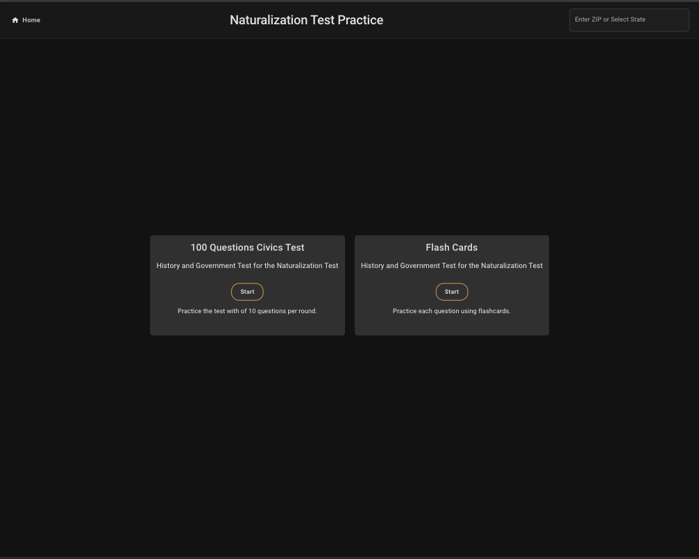
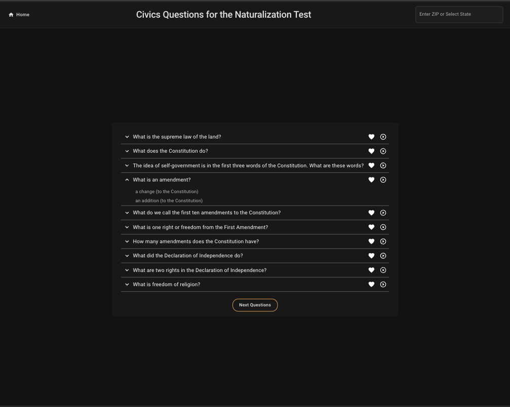
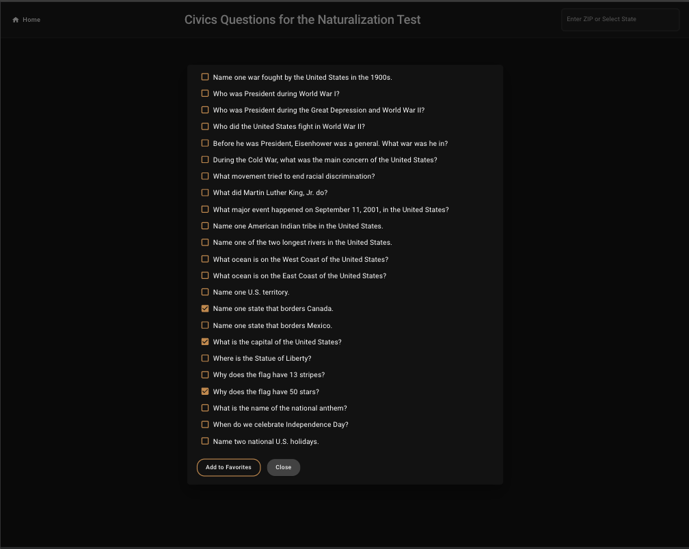
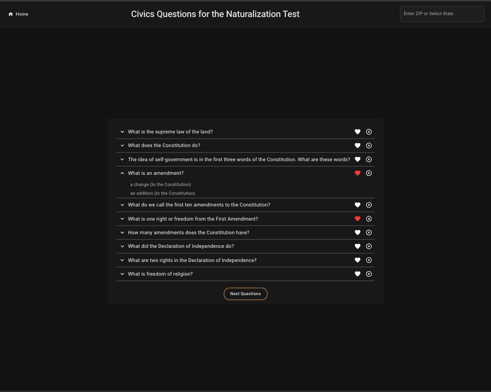
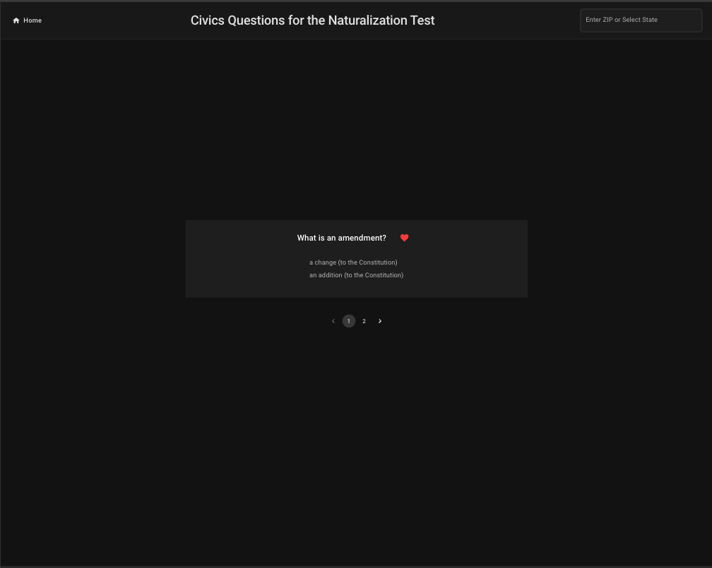
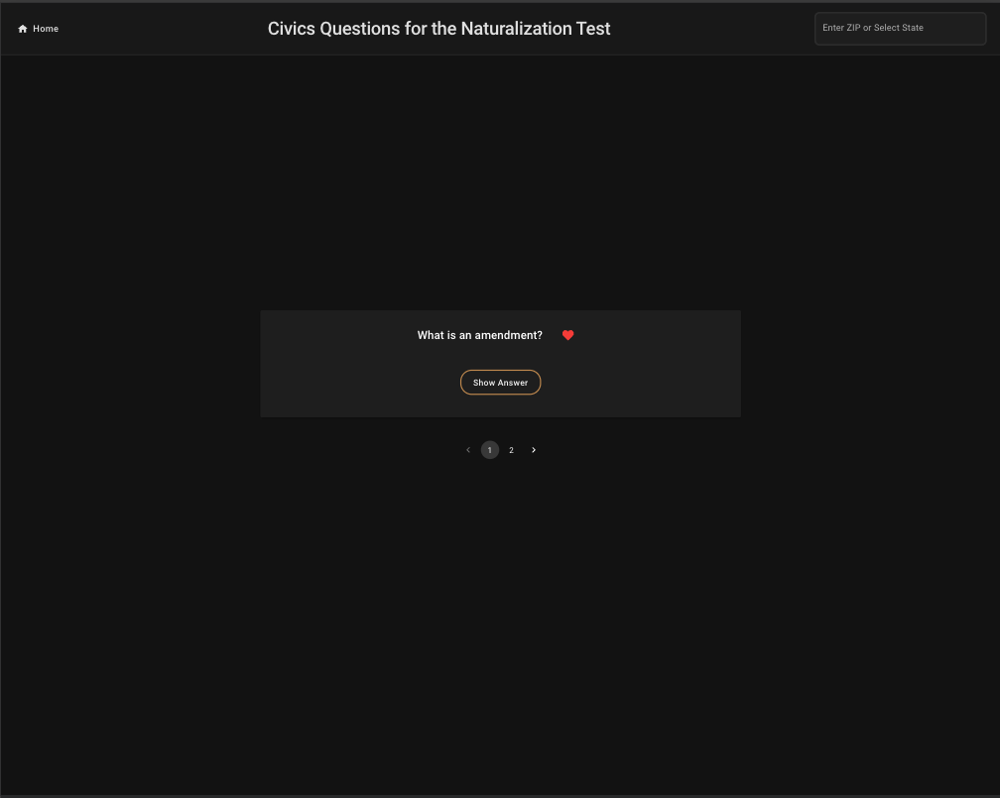

# App Screenshots & Features Overview

This section provides a visual overview of key features and screens in the application.

---

### Home Screen
The landing page of the application where users can navigate to the questions or flashcards of their favorite sets.

---

### Questions Page
Displays a list of questions fetched from the backend. Users can attempt to answer each question, and if they don’t know the answer, they can expand the question to reveal it.
This screen also features a text-to-speech option for practicing listening comprehension.
Users can mark difficult questions as favorites for quicker access during review sessions.

---

### Add to Favorites
From the full question list, users can click the checkbox next to any question to add it to their list of favorites.

---

### Favorite Questions
A dedicated screen that displays a user’s favorite questions. Ideal for targeted review and reinforcement.

---

### View Flashcard Answer
Users can study using flashcards, flipping each one to reveal the answer. A simple and effective tool for self-paced learning.

---

### Paginate Favorites
Favorite questions are paginated for easier navigation when dealing with large sets.

